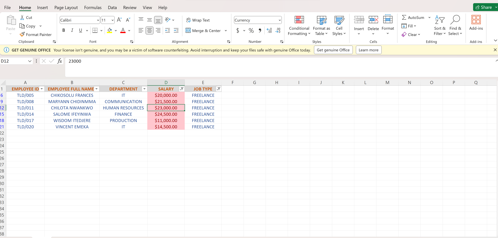
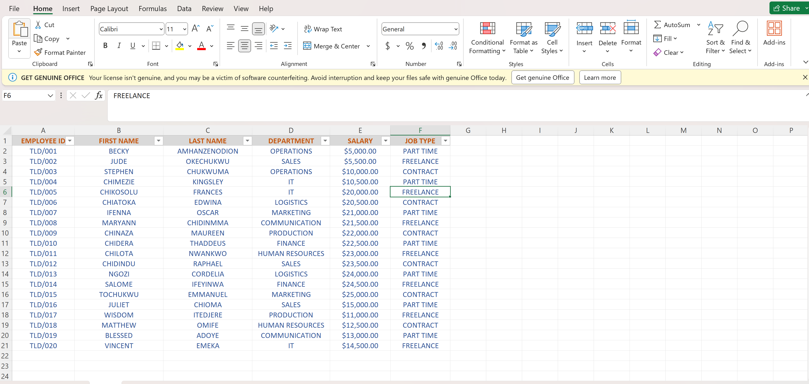
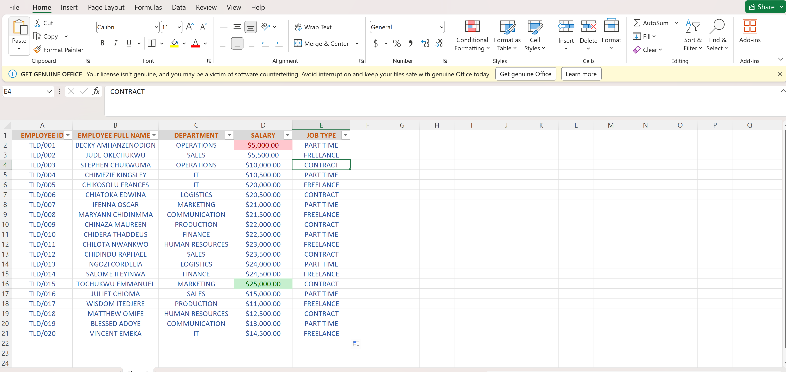

# TLD_Inc.

# TELLDREAMS INC.

## Introduction
### The dummy data on this data set was created using Microsoft Excel to reconcile the discrepancy in the company records which borders around employee names, salaries and job type.

## Features used in excel
Formulas, Conditional statements and filters.

## Problem Statement
This file consists of 3 worksheets
In worksheet 1, show only employees who are freelancers and highlight the ones whose salaries are above $10,000.
In worksheet 2, split the employees full names into first names and last names. Check for duplicate and highlight if any (Do not delete).
In worksheet 3, highlight employees whose names begin with the letter ‘E’ (in yellow). Format the salary column such that the highest salary has a green background and the lowest salary has a red background.
---
---
#ANALYSIS
---
In worksheet one, there are 7 freelance employees but only 6 of them earn above $10,000

---
In worksheet 2, after splitting the names into first name and last name no duplicate names was found.

---
In worksheet 3, no employee has a name that begins with the letter “E” and the highest salary is $25,000 while the lowest salary is $5,000 highlighted in green and red background respectively.

---
---
---

